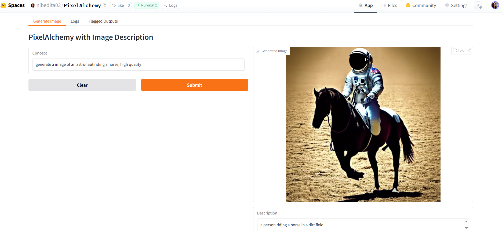

# 🎨 PixelAlchemy: Text-to-Image Generation with Auto-Description

## ✨ Overview
**PixelAlchemy** is a generative AI project that transforms text prompts into vivid images using Stable Diffusion.  
It’s designed not just as a technical demo, but as a portfolio showcase — highlighting my ability to build, deploy, and polish ML/AI apps with real-world constraints.

---

## 🌟 Portfolio Note
PixelAlchemy is part of my AI portfolio, built to demonstrate practical ML engineering, creative branding, and transparency through live demos.

---

## 🚀 Features
- 🖼️ **Text-to-Image Generation** — powered by Stable Diffusion v1.5  
- 📝 **Auto-Description** — BLIP captions each generated image for transparency  
- 📊 **Lightweight Logging** — reproducible outputs for review  
- 🌐 **Live Demo** — deployed on Hugging Face Spaces  

👉 Try it here: [PixelAlchemy on Hugging Face Spaces](https://huggingface.co/spaces/nibedita03/PixelAlchemy)

---

## 📸 Screenshots



  
*Generated image from prompt: “an astronaut riding a horse” — showcasing surreal text-to-image capability.*

  
*Prompt: “a beautiful landscape” — with auto-caption describing a river and mountain range.*

---

## ⚙️ Installation (Local Run)
Clone the repo and install dependencies:
```bash
git clone https://github.com/nitasa03/PixelAlchemy.git
cd PixelAlchemy
pip install -r requirements.txt
python app.py
```
---

## 🛠️ Tech Stack
- **Python** (Gradio for UI)  
- **Stable Diffusion v1.5** (text-to-image)  
- **BLIP** (image captioning)  
- **Hugging Face Spaces** (deployment)
---

## 📁 Project Structure
```
PixelAlchemy/
├── app.py              # Main Gradio app
├── requirements.txt    # Dependencies
├── README.md           # Project overview
├── .gitignore          # Ignore large/cache files
└── .gitattributes      # Git config
```
---
## 🗂️ Version
**V1.0** — Initial public release
---
## 📬 Contact
Created by **Nibedita**
```


